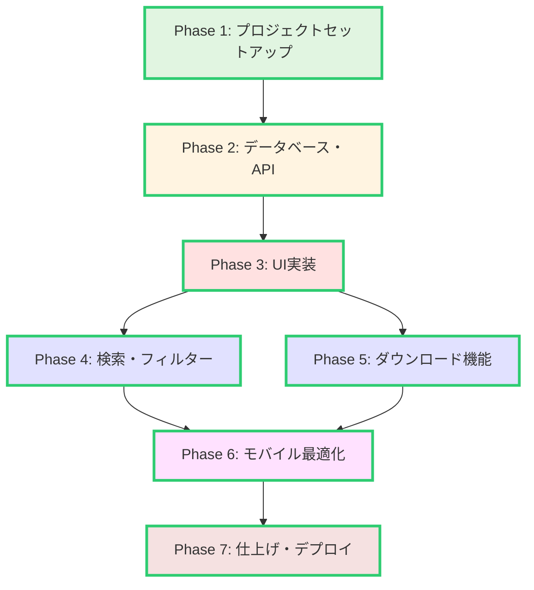
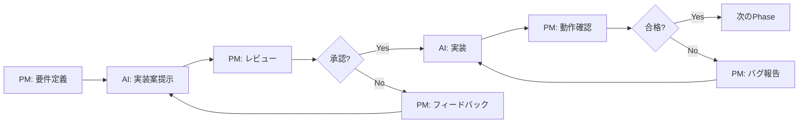
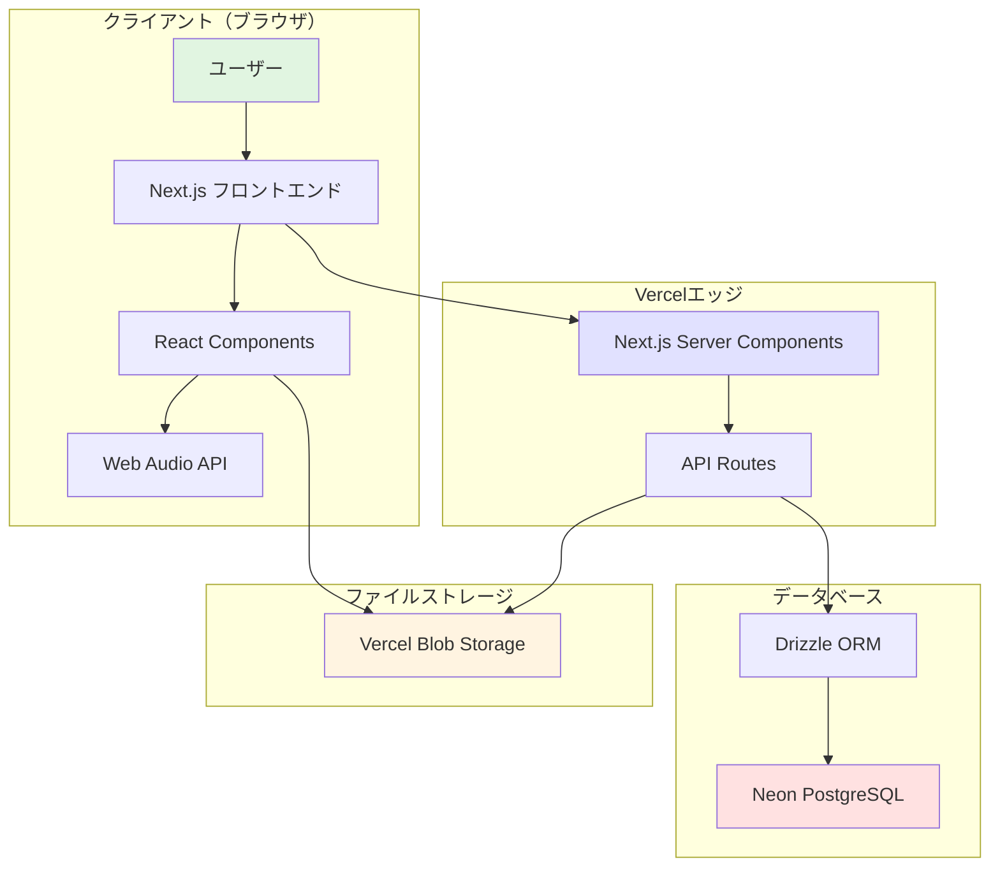
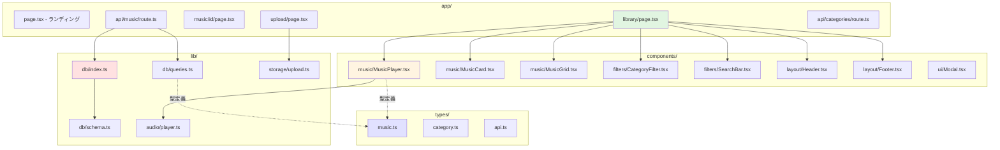
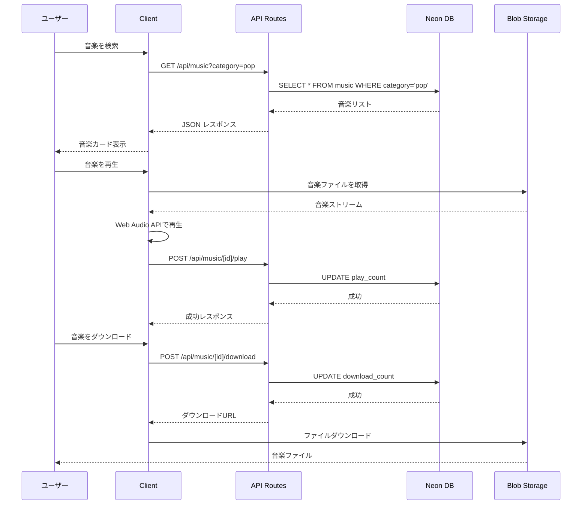
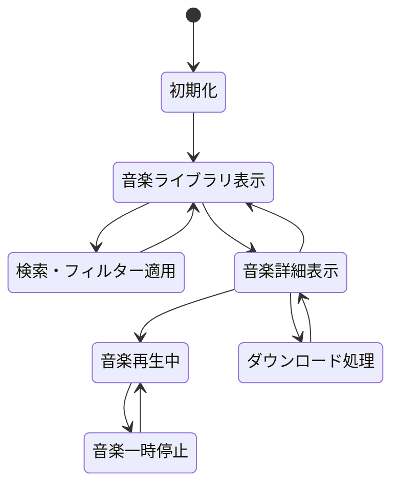

# Kaleido AI Music プロジェクト全体概要

**作成日**: 2025年10月23日
**ドキュメントバージョン**: 1.0
**対象者**: 開発者、プロジェクトマネージャー

---

## 目次

1. [プロジェクト概要](#プロジェクト概要)
2. [ビジョンと目的](#ビジョンと目的)
3. [開発方針と設計思想](#開発方針と設計思想)
4. [技術スタック詳細解説](#技術スタック詳細解説)
5. [全Phase一覧とフローチャート](#全phase一覧とフローチャート)
6. [開発スケジュール見積もり](#開発スケジュール見積もり)
7. [リスク管理マトリクス](#リスク管理マトリクス)
8. [チーム体制](#チーム体制)
9. [成功基準（KPI）](#成功基準kpi)
10. [アーキテクチャ図](#アーキテクチャ図)

---

## プロジェクト概要

### プロジェクト名
**Kaleido AI Music** - AI生成音楽ライブラリプラットフォーム

### エグゼクティブサマリー

Kaleido AI Musicは、AI生成音楽を展示・共有できる専用プラットフォームです。外部AIプラットフォーム（Suno AI、Udio等）で生成した音楽をアップロード・公開し、多くの人に手軽に視聴・ダウンロードしてもらうことを目的としたWebアプリケーションです。

スマートフォンユーザーをメインターゲットとし、モバイルファーストのデザインで、誰でも簡単にAI音楽を楽しめる環境を提供します。

### プロジェクトの背景

近年、Suno AI、Udio、MusicGen等のAI音楽生成プラットフォームが急速に普及しています。しかし、生成した音楽を展示・共有する専用プラットフォームは少なく、多くのクリエイターがYouTubeやSoundCloudなど一般的な音楽共有サイトに依存している現状があります。

本プロジェクトは、以下の課題を解決します:
- **AI音楽専用の展示場所**: AI音楽に特化したライブラリサイト
- **手軽なアクセス**: スマホで簡単に視聴・ダウンロード
- **カテゴリ・タグによる整理**: ジャンル別、用途別での検索・フィルタリング
- **無料アクセス**: インターネット上で誰でもアクセス可能

---

## ビジョンと目的

### ビジョン

> 「AI音楽を、もっと身近に」
>
> AI生成音楽の可能性を広げ、クリエイターとリスナーをつなぐプラットフォームを提供します。

### プロジェクトの目的

1. **AI音楽の普及促進**
   - AI生成音楽の認知度向上
   - クリエイターが作品を公開できる場の提供
   - リスナーが気軽にAI音楽を楽しめる環境

2. **モバイルファースト体験**
   - スマートフォンでの快適な視聴体験
   - タッチ操作に最適化されたUI
   - レスポンシブデザインによる全デバイス対応

3. **技術的実証**
   - Next.js 14の最新機能（App Router、Server Components）の活用
   - Neon PostgreSQLのサーバーレスデータベース活用
   - Vercel Blob Storageによる音楽ファイル管理
   - Web Audio APIによる高品質な音楽再生

### ターゲットユーザー

| ユーザー層 | ニーズ | 利用シーン |
|-----------|--------|-----------|
| **AI音楽クリエイター** | 自分の作品を多くの人に聴いてもらいたい | 作品公開、ポートフォリオ |
| **動画制作者** | 無料の音楽素材を探している | BGM素材の検索・ダウンロード |
| **音楽リスナー** | 新しい音楽ジャンルを発見したい | 日常的な音楽視聴 |
| **研究者・開発者** | AI音楽の最新トレンドを知りたい | 技術調査、研究 |

---

## 開発方針と設計思想

### コア原則

#### 1. モバイルファースト（Mobile First）
- **スマホ最優先**: タッチ操作に最適化されたUI
- **レスポンシブデザイン**: タブレット、PCでも快適に利用可能
- **パフォーマンス**: モバイル通信でも高速ロード

#### 2. シンプルさの追求（KISS原則）
- **最小限の機能**: 必要十分な機能のみ実装
- **直感的操作**: 説明不要のユーザーインターフェース
- **クリーンコード**: TypeScriptによる型安全性と可読性の確保

#### 3. 拡張性の確保
- **モジュラー設計**: 各機能は独立したコンポーネント
- **API設計**: RESTful APIによる疎結合
- **将来的な機能追加を想定**: ユーザー認証、コメント機能など

#### 4. パフォーマンス優先
- **React Server Components**: 初回レンダリングの高速化
- **静的最適化**: Tailwind CSSのPurge機能
- **遅延読み込み**: 必要なコンポーネントのみ動的インポート
- **音楽ファイルの最適化**: 適切なビットレート、フォーマット

### 技術的制約と意図的な省略

本プロトタイプでは、以下の機能を**意図的にスコープ外**としています:

| 省略機能 | 理由 | 将来の拡張可能性 |
|---------|------|----------------|
| ユーザー認証（一般ユーザー） | 開発工数削減、誰でもアクセス可能にするため | Phase 8以降で追加検討 |
| コメント・レビュー機能 | 複雑性を避け、基本機能に集中 | Phase 9で追加 |
| プレイリスト機能 | プロトタイプの範囲を超える | Phase 10で検討 |
| AI音楽生成機能統合 | 外部プラットフォーム依存の設計 | Phase 11で検討 |
| 有料ダウンロード機能 | 収益化はスコープ外 | Phase 12で検討 |

---

## 技術スタック詳細解説

### フロントエンド技術

#### Next.js 14（App Router）

**選定理由:**
- **Server Components**: 初回ロードの高速化、SEO最適化
- **File-based Routing**: 直感的なルーティング設定
- **API Routes統合**: フロントエンドとバックエンドの統一環境
- **Vercel最適化**: デプロイの簡素化

**主要機能の活用:**
```typescript
// app/library/page.tsx (Server Component)
export default async function LibraryPage() {
  // サーバーサイドでの初期データ取得
  const musicList = await fetchMusicList();
  return <LibraryClient initialMusicList={musicList} />;
}

// app/library/LibraryClient.tsx (Client Component)
'use client';
export function LibraryClient({ initialMusicList }) {
  // クライアントサイドのインタラクティブな操作
  const [currentTrack, setCurrentTrack] = useState(null);
  // ...
}
```

#### TypeScript 5+

**選定理由:**
- **型安全性**: コンパイル時のエラー検出
- **開発者体験**: IntelliSenseによる補完
- **リファクタリング容易性**: 型情報による安全な変更

**型システム設計方針:**
```typescript
// 音楽データの型定義
interface Music {
  id: string;
  title: string;
  artist: string;
  audioUrl: string;
  imageUrl: string;
  duration: number;
  category: Category;
  tags: Tag[];
  createdAt: Date;
  playCount: number;
  downloadCount: number;
}

// Type Guardsによる安全な型ナローイング
function isMusic(data: unknown): data is Music {
  return (
    typeof data === 'object' &&
    data !== null &&
    'id' in data &&
    'title' in data
  );
}
```

#### Tailwind CSS 3+

**選定理由:**
- **高速開発**: ユーティリティクラスによる迅速なスタイリング
- **一貫性**: デザインシステムの統一
- **バンドルサイズ最適化**: 使用されたクラスのみ出力
- **カスタマイズ性**: tailwind.config.tsでの柔軟な設定

**カスタム設定例:**
```typescript
// tailwind.config.ts
export default {
  theme: {
    extend: {
      colors: {
        primary: {
          50: '#f0f9ff',
          100: '#e0f2fe',
          // ... 省略
          900: '#0c4a6e',
        },
        accent: {
          light: '#fbbf24',
          DEFAULT: '#f59e0b',
          dark: '#d97706',
        },
      },
      fontFamily: {
        sans: ['Inter', 'sans-serif'],
        display: ['Poppins', 'sans-serif'],
      },
    },
  },
};
```

#### Web Audio API

**選定理由:**
- **高品質再生**: ネイティブブラウザ機能による最適化
- **詳細な制御**: ボリューム、シーク、再生速度調整
- **クロスブラウザ対応**: モダンブラウザでのサポート
- **パフォーマンス**: HTMLAudioElement より高パフォーマンス

**実装パターン:**
```typescript
class AudioPlayer {
  private audioContext: AudioContext;
  private source: AudioBufferSourceNode | null = null;

  constructor() {
    this.audioContext = new AudioContext();
  }

  async loadTrack(url: string): Promise<void> {
    const response = await fetch(url);
    const arrayBuffer = await response.arrayBuffer();
    const audioBuffer = await this.audioContext.decodeAudioData(arrayBuffer);

    this.source = this.audioContext.createBufferSource();
    this.source.buffer = audioBuffer;
    this.source.connect(this.audioContext.destination);
  }

  play(): void {
    this.source?.start(0);
  }

  pause(): void {
    this.source?.stop();
  }
}
```

### バックエンド・データベース技術

#### Drizzle ORM

**選定理由:**
- **型安全性**: TypeScriptとの完全統合
- **軽量**: Prismaより小さいバンドルサイズ
- **柔軟性**: 生SQLに近い記述
- **マイグレーション**: シンプルなスキーマ管理

**スキーマ定義例:**
```typescript
// lib/db/schema.ts
import { pgTable, serial, text, timestamp, integer, json } from 'drizzle-orm/pg-core';

export const music = pgTable('music', {
  id: serial('id').primaryKey(),
  title: text('title').notNull(),
  artist: text('artist').notNull(),
  audioUrl: text('audio_url').notNull(),
  imageUrl: text('image_url').notNull(),
  duration: integer('duration').notNull(),
  category: text('category').notNull(),
  tags: json('tags').$type<string[]>().notNull(),
  description: text('description'),
  aiPlatform: text('ai_platform'),
  playCount: integer('play_count').default(0),
  downloadCount: integer('download_count').default(0),
  createdAt: timestamp('created_at').defaultNow(),
  updatedAt: timestamp('updated_at').defaultNow(),
});

export const categories = pgTable('categories', {
  id: serial('id').primaryKey(),
  name: text('name').notNull().unique(),
  slug: text('slug').notNull().unique(),
  description: text('description'),
  icon: text('icon'),
  createdAt: timestamp('created_at').defaultNow(),
});

export const tags = pgTable('tags', {
  id: serial('id').primaryKey(),
  name: text('name').notNull().unique(),
  slug: text('slug').notNull().unique(),
  count: integer('count').default(0),
  createdAt: timestamp('created_at').defaultNow(),
});
```

#### Neon PostgreSQL

**選定理由:**
- **サーバーレス**: 使用量に応じた自動スケーリング
- **無料枠**: 0.5GBストレージ、十分な開発・プロトタイプ用途
- **低レイテンシ**: エッジネットワーク対応
- **開発者体験**: 簡単なセットアップ、Web UI

**接続設定:**
```typescript
// lib/db/index.ts
import { neon } from '@neondatabase/serverless';
import { drizzle } from 'drizzle-orm/neon-http';
import * as schema from './schema';

const sql = neon(process.env.DATABASE_URL!);
export const db = drizzle(sql, { schema });
```

#### Vercel Blob Storage

**選定理由:**
- **Next.js統合**: Vercelとのシームレスな連携
- **無料枠**: 月間100GB転送、十分なプロトタイプ用途
- **CDN配信**: グローバルエッジネットワーク
- **簡単な操作**: シンプルなAPI

**ファイルアップロード例:**
```typescript
// lib/storage/upload.ts
import { put } from '@vercel/blob';

export async function uploadMusic(file: File): Promise<string> {
  const blob = await put(`music/${Date.now()}-${file.name}`, file, {
    access: 'public',
  });
  return blob.url;
}

export async function uploadImage(file: File): Promise<string> {
  const blob = await put(`images/${Date.now()}-${file.name}`, file, {
    access: 'public',
  });
  return blob.url;
}
```

### デプロイ・インフラ

#### Vercel

**選定理由:**
- **Next.js最適化**: 開発元による完全サポート
- **自動CI/CD**: GitHubプッシュで自動デプロイ
- **エッジネットワーク**: グローバルCDN
- **無料枠**: 個人プロジェクトに十分

**デプロイ設定:**
```json
// vercel.json
{
  "buildCommand": "npm run build",
  "devCommand": "npm run dev",
  "installCommand": "npm install",
  "env": {
    "DATABASE_URL": "@database-url",
    "BLOB_READ_WRITE_TOKEN": "@blob-token"
  }
}
```

---

## 全Phase一覧とフローチャート

### Phase概要

プロジェクトは7のPhaseに分割され、段階的に機能を実装します。Phase 1-5が**MVP（Minimum Viable Product）**として最優先で開発され、Phase 6-7は最適化とデプロイとして位置づけられます。

### Phase詳細

#### Phase 1: プロジェクトセットアップ（時間見積: 1日）

**目的:** 開発環境の構築とベース設定

**タスク:**
1. Next.js 14プロジェクト初期化（`create-next-app`）
2. TypeScript設定（`tsconfig.json`）
3. Tailwind CSS設定（`tailwind.config.ts`、`postcss.config.js`）
4. 依存パッケージインストール（Drizzle ORM、Vercel Blob等）
5. ディレクトリ構造作成
6. Git初期化とリモートリポジトリ設定
7. ESLint/Prettier設定

**成果物:**
- 動作するNext.js開発サーバー
- 全設定ファイルの完成
- Git履歴の初期化

**チェックリスト:**
- [ ] `npm run dev`で開発サーバー起動
- [ ] TypeScript型チェック成功
- [ ] Tailwind CSSクラスが適用される
- [ ] ESLint警告なし

**詳細ドキュメント:** `20251023_01-project-setup.md`

---

#### Phase 2: データベース・API構築（時間見積: 2日）

**目的:** Neon PostgreSQL、Drizzle ORM設定とAPI Routes実装

**タスク:**
1. Neonアカウント作成とデータベース作成
2. 接続文字列取得と`.env.local`設定
3. Drizzle ORMスキーマ定義（`lib/db/schema.ts`）
   - musicテーブル
   - categoriesテーブル
   - tagsテーブル
4. Drizzle設定ファイル（`drizzle.config.ts`）
5. マイグレーション実行
6. API Routes実装
   - `GET /api/music` - 音楽一覧
   - `GET /api/music/[id]` - 音楽詳細
   - `POST /api/music` - 音楽作成（管理者）
   - `PUT /api/music/[id]` - 音楽更新
   - `DELETE /api/music/[id]` - 音楽削除
   - `GET /api/categories` - カテゴリ一覧
   - `GET /api/tags` - タグ一覧
7. Vercel Blob Storage統合
8. ファイルアップロード機能

**成果物:**
- 動作するデータベース接続
- music、categories、tagsテーブル
- 完全なCRUD API

**チェックリスト:**
- [ ] データベース接続成功
- [ ] テーブル作成完了
- [ ] CRUD操作のテスト成功
- [ ] ファイルアップロード成功

**詳細ドキュメント:** `20251023_02-database-api.md`

---

#### Phase 3: UI実装（時間見積: 2-3日）

**目的:** ランディングページ、音楽ライブラリ、詳細ページ、プレイヤーの実装

**タスク:**
1. ランディングページ（`app/page.tsx`）
   - ヒーローセクション
   - 機能紹介セクション
   - 人気音楽セクション
   - CTAセクション
2. 音楽ライブラリページ（`app/library/page.tsx`）
   - グリッドレイアウト
   - 音楽カード表示
   - カテゴリフィルター
   - 検索バー
3. 音楽詳細ページ（`app/music/[id]/page.tsx`）
   - 音楽情報表示
   - 音楽プレイヤー統合
   - ダウンロードボタン
   - 関連音楽セクション
4. 音楽プレイヤーコンポーネント（`components/music/MusicPlayer.tsx`）
   - Web Audio API統合
   - 再生/一時停止
   - シークバー
   - ボリューム調整
   - 前/次トラック
5. 共通UIコンポーネント
   - Modal、Toast、Spinner
   - Button、Input
   - MusicCard、CategoryFilter
6. レイアウトコンポーネント
   - Header、Footer、Navigation

**成果物:**
- 完全なランディングページ
- 音楽ライブラリ画面
- 音楽詳細ページ
- 動作する音楽プレイヤー

**チェックリスト:**
- [ ] レイアウトが正しく表示
- [ ] 音楽プレイヤーが動作
- [ ] 音楽一覧が表示される
- [ ] 音楽詳細ページが表示される

**詳細ドキュメント:** `20251023_03-ui-implementation.md`

---

#### Phase 4: 検索・フィルター機能（時間見積: 1-2日）

**目的:** カテゴリ・タグフィルター、検索、ソート機能の実装

**タスク:**
1. カテゴリフィルターコンポーネント
2. タグフィルターコンポーネント
3. キーワード検索機能
4. ソート機能（新着順、人気順、ダウンロード数順）
5. フィルター状態管理（URL同期）
6. 検索結果のページネーション
7. 「結果が0件」時の表示

**成果物:**
- 完全な検索・フィルター機能
- URL同期による共有可能なフィルター状態

**チェックリスト:**
- [ ] カテゴリフィルターが動作
- [ ] タグフィルターが動作
- [ ] 検索機能が動作
- [ ] ソート機能が動作
- [ ] URLでフィルター状態を共有可能

**詳細ドキュメント:** `20251023_04-search-filter.md`

---

#### Phase 5: ダウンロード機能（時間見積: 1日）

**目的:** 音楽ダウンロード機能と統計トラッキングの実装

**タスク:**
1. ダウンロードボタンUI
2. ダウンロードAPI（`POST /api/music/[id]/download`）
3. ダウンロード数のカウントアップ
4. 再生回数のカウントアップ
5. 統計情報の表示
6. アップロード機能（管理者向け）
   - アップロードフォーム
   - ファイルバリデーション
   - メタデータ入力
   - サムネイル画像アップロード

**成果物:**
- ダウンロード機能
- 統計トラッキング
- 管理者向けアップロード機能

**チェックリスト:**
- [ ] ダウンロードが動作
- [ ] ダウンロード数が増加
- [ ] 再生回数が増加
- [ ] アップロード機能が動作

**詳細ドキュメント:** `20251023_05-download-feature.md`

---

#### Phase 6: モバイル最適化（時間見積: 1-2日）

**目的:** レスポンシブデザイン、タッチ操作、パフォーマンスチューニング

**タスク:**
1. レスポンシブデザイン調整
   - ブレークポイント設定（sm、md、lg、xl）
   - タッチ操作最適化
   - スワイプジェスチャー
2. パフォーマンス最適化
   - 画像の遅延読み込み
   - コード分割
   - バンドルサイズ削減
3. モバイルブラウザテスト
   - iOS Safari
   - Android Chrome
   - タブレット

**成果物:**
- モバイルで快適に動作するUI
- パフォーマンス最適化済み

**チェックリスト:**
- [ ] モバイルで正しく表示
- [ ] タッチ操作が快適
- [ ] パフォーマンステスト合格
- [ ] 画像が最適化されている

**詳細ドキュメント:** `20251023_06-mobile-optimization.md`

---

#### Phase 7: 仕上げ・デプロイ（時間見積: 1日）

**目的:** バグフィックス、UI/UX改善、本番デプロイ

**タスク:**
1. エッジケーステスト
2. UI/UXポリッシュ
   - ローディング状態
   - エラーメッセージ改善
   - アクセシビリティ対応
3. パフォーマンス最適化
   - 画像最適化
   - バンドルサイズ削減
4. Vercelデプロイ設定
5. 環境変数設定
6. 本番デプロイ
7. 動作確認

**成果物:**
- 本番環境で動作するアプリケーション
- 公開URL

**チェックリスト:**
- [ ] すべての機能が動作
- [ ] エラーなし
- [ ] パフォーマンステスト合格
- [ ] 本番環境でアクセス可能

**詳細ドキュメント:** `20251023_07-polish-deploy.md`

---

### Phase間の依存関係フローチャート



**凡例:**
- 緑色: セットアップ系（Phase 1）
- 黄色: バックエンド系（Phase 2）
- 赤色: UI実装（Phase 3）
- 青色: 機能実装（Phase 4-5）
- 紫色: 最適化（Phase 6）
- ピンク色: デプロイ（Phase 7）

---

## 開発スケジュール見積もり

### 総見積時間: 9-12日

### タスクブレイクダウン（累計日数）

| Phase | タスク | 最小日数 | 最大日数 | 累計（最大） |
|-------|--------|---------|---------|------------|
| **Phase 1** | プロジェクトセットアップ | 1日 | 1日 | 1日 |
| **Phase 2** | データベース・API | 2日 | 2日 | 3日 |
| **Phase 3** | UI実装 | 2日 | 3日 | 6日 |
| **Phase 4** | 検索・フィルター | 1日 | 2日 | 8日 |
| **Phase 5** | ダウンロード機能 | 1日 | 1日 | 9日 |
| **Phase 6** | モバイル最適化 | 1日 | 2日 | 11日 |
| **Phase 7** | 仕上げ・デプロイ | 1日 | 1日 | **12日** |

### 開発モデル: アジャイルスプリント

**スプリント構成:**
- **Sprint 1（3日）**: Phase 1-2（基盤構築）
- **Sprint 2（3-4日）**: Phase 3（UI実装）
- **Sprint 3（2-3日）**: Phase 4-5（機能実装）
- **Sprint 4（2-3日）**: Phase 6-7（最適化・デプロイ）

**デイリーチェックポイント:**
- 毎日の終了時に動作確認
- Gitコミット（意味のある単位）
- 次の日の作業計画立案

### バッファ時間

予期しない問題に備えて、総見積時間の20%（約2-3日）をバッファとして確保:

**合計開発時間: 12日 + 2-3日バッファ = 約14-15日**

**実稼働日数見積:**
- **集中開発**: 9-12日（1日6-8時間作業）
- **通常ペース**: 14-20日（1日3-4時間作業）

---

## リスク管理マトリクス

### リスク評価基準

**影響度:**
- 高: プロジェクト完成に致命的
- 中: 機能制限が発生
- 低: 軽微な影響

**発生確率:**
- 高: 50%以上
- 中: 20-50%
- 低: 20%未満

### リスク一覧

| ID | リスク項目 | 影響度 | 確率 | リスクレベル | 軽減策 | 対応策 |
|----|-----------|-------|------|------------|--------|--------|
| R1 | Neon無料枠の制限超過 | 中 | 低 | 低 | データ量監視、最適化 | 有料プランへのアップグレード |
| R2 | Vercel Blob無料枠の制限超過 | 中 | 中 | 中 | ファイルサイズ制限、圧縮 | Cloudinaryへの切り替え |
| R3 | Web Audio APIのブラウザ互換性 | 中 | 中 | 中 | モダンブラウザのみサポート明記 | Polyfillの追加 |
| R4 | 音楽ファイルの著作権問題 | 高 | 低 | 中 | AI生成音楽のみ許可、規約明記 | 削除依頼への迅速対応 |
| R5 | パフォーマンス問題（モバイル） | 中 | 中 | 中 | 画像・音楽ファイルの最適化 | パフォーマンスプロファイリング |
| R6 | Vercelデプロイエラー | 高 | 低 | 中 | ローカルで`npm run build`テスト | ビルドログ確認、環境変数確認 |
| R7 | セキュリティ脆弱性（XSS等） | 高 | 中 | 高 | サニタイゼーション実装 | セキュリティ監査、ライブラリ更新 |
| R8 | スコープクリープ | 中 | 高 | 高 | 厳格なPhase管理 | Phase 8以降を後回し |

### 高リスク項目への対応

#### R7: セキュリティ脆弱性

**具体的対策:**
```typescript
// ユーザー入力のサニタイゼーション
import DOMPurify from 'isomorphic-dompurify';

function sanitizeInput(input: string): string {
  return DOMPurify.sanitize(input, {
    ALLOWED_TAGS: [],
    ALLOWED_ATTR: [],
  });
}
```

#### R8: スコープクリープ

**防止策:**
- Phase 1-7の厳格な定義
- 新機能要望は「将来の拡張」リストに追加
- MVP完成を最優先

---

## チーム体制

### プロジェクト構成

本プロジェクトは、**1名のプロジェクトマネージャー（PM）+ AIエージェント**による開発体制です。

### 役割定義

#### プロジェクトマネージャー（あなた）

**責任範囲:**
- プロジェクト全体の意思決定
- Phase進行の管理
- 最終的なコード品質の確認
- デザイン判断
- デプロイ実行

**作業内容:**
- ドキュメント確認
- コードレビュー
- バグテスト
- UI/UX検証

#### AIエージェント（Claude）

**責任範囲:**
- コード実装
- ドキュメント作成
- 技術調査
- ベストプラクティス提案

**作業内容:**
- TypeScriptコードの生成
- 設定ファイルの作成
- バグ修正の提案
- パフォーマンス最適化の提案

### コミュニケーションフロー



### 開発ワークフロー

1. **Phase開始**
   - PMがPhaseドキュメント確認
   - AIに実装指示

2. **実装**
   - AIがコード生成
   - PMがリアルタイムレビュー

3. **テスト**
   - PMが動作確認
   - バグがあればAIに修正依頼

4. **完了**
   - Gitコミット
   - 次のPhaseへ

---

## 成功基準（KPI）

### 技術的KPI

| 指標 | 目標値 | 測定方法 |
|------|--------|---------|
| **ビルド成功率** | 100% | `npm run build`の成功 |
| **TypeScript型エラー** | 0件 | `npm run type-check` |
| **ESLint警告** | 5件以下 | `npm run lint` |
| **バンドルサイズ** | 500KB以下 | Webpack Bundle Analyzer |
| **Lighthouse Performance** | 90点以上 | Lighthouse CI |
| **Lighthouse Accessibility** | 95点以上 | Lighthouse CI |
| **初回ロード時間** | 2秒以下 | Chrome DevTools |
| **音楽再生開始時間** | 1秒以下 | Web Audio API測定 |

### 機能的KPI

| 機能 | 成功基準 |
|------|---------|
| **音楽再生** | スムーズに再生、遅延なし |
| **音楽ダウンロード** | 100%の確率でダウンロード成功 |
| **検索・フィルター** | リアルタイムで反映 |
| **モバイル表示** | すべての画面でレスポンシブ対応 |
| **クロスブラウザ** | Chrome, Firefox, Safari, Edgeで動作 |

### ユーザー体験KPI

| 指標 | 目標 |
|------|------|
| **初回利用での理解** | 説明なしで操作可能 |
| **音楽再生までの時間** | 30秒以内 |
| **エラーメッセージの明確性** | 原因と対処法が明示 |
| **モバイルでの操作性** | タッチ操作でストレスなし |

### ビジネスKPI（将来的）

| 指標 | 目標値 |
|------|--------|
| **月間アクティブユーザー（MAU）** | 100人 |
| **月間再生回数** | 500回 |
| **月間ダウンロード数** | 100回 |
| **平均セッション時間** | 5分以上 |

---

## アーキテクチャ図

### システム全体構成図



### コンポーネント構成図



### データフロー図



### 状態管理フロー



---

## 次のステップ

### 今すぐ開始

1. **Phase 1ドキュメントを確認**
   - `20251023_01-project-setup.md`を開く
   - プロジェクトセットアップ手順に従う

2. **開発環境の準備**
   - Node.js 18.x以上をインストール
   - VSCodeまたは好みのエディタを準備
   - Gitをインストール

3. **Neonアカウント作成**
   - https://neon.tech でアカウント作成
   - 新しいプロジェクトを作成
   - 接続文字列をコピー

4. **Vercelアカウント作成**
   - https://vercel.com でアカウント作成
   - GitHubと連携

### 推奨の学習リソース

- **Next.js公式ドキュメント**: https://nextjs.org/docs
- **Drizzle ORM**: https://orm.drizzle.team/
- **Tailwind CSS**: https://tailwindcss.com/docs
- **Web Audio API**: https://developer.mozilla.org/en-US/docs/Web/API/Web_Audio_API

### サポートとコミュニケーション

質問やフィードバックがあれば、いつでもAIエージェントに相談してください:
- コードレビューの依頼
- バグ修正の支援
- パフォーマンス最適化の提案
- 新機能のアイデア検討

---

## まとめ

Kaleido AI Musicプロジェクトは、7のPhaseに分かれた体系的な開発計画により、約9-12日で完成予定です。Next.js 14、TypeScript、Tailwind CSS、Web Audio API、Drizzle ORM、Neon PostgreSQL、Vercel Blob Storageといった最新技術スタックを活用し、スマートフォンでAI音楽を楽しめるプラットフォームを実現します。

段階的な開発アプローチにより、各Phaseで明確な成果物を生み出し、最終的にはVercelで公開される完全なWebアプリケーションとなります。

**次のドキュメント:** `20251023_01-project-setup.md`（プロジェクトセットアップ詳細手順）

---

**ドキュメント作成者**: AI Agent (Claude)
**最終更新日**: 2025年10月23日
**バージョン**: 1.0
