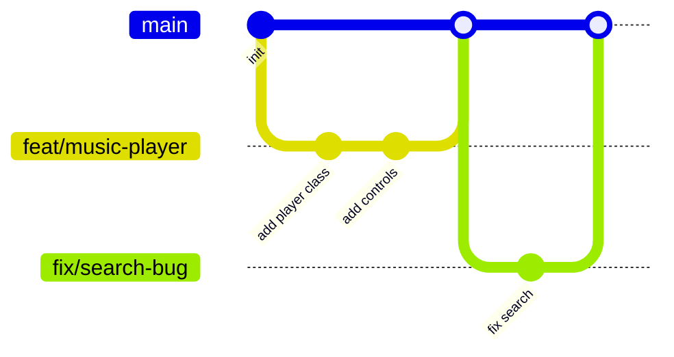

# Git運用戦略 - コミット・ブランチ管理ガイド

**作成日**: 2025年10月23日
**対象者**: 開発者
**バージョン**: 1.0

---

## 目次

1. [概要](#概要)
2. [コミットメッセージ規約](#コミットメッセージ規約)
3. [ブランチ戦略](#ブランチ戦略)
4. [コミットの粒度](#コミットの粒度)
5. [実践例](#実践例)
6. [Gitフロー](#gitフロー)
7. [トラブルシューティング](#トラブルシューティング)

---

## 概要

Kaleido AI Musicプロジェクトでは、明確なGit運用戦略に従って開発を進めます。これにより、変更履歴が追跡しやすくなり、チーム開発（将来的）がスムーズになります。

### 基本原則

1. **意味のある単位でコミット**: 1つの機能・修正につき1コミット
2. **明確なメッセージ**: 何を変更したかが一目で分かるメッセージ
3. **Conventional Commits**: 標準的なコミット規約に従う
4. **頻繁なコミット**: 小さな変更も積極的にコミット

---

## コミットメッセージ規約

### Conventional Commits

**フォーマット:**
```
<type>(<scope>): <subject>

<body>

<footer>
```

### Type（必須）

| Type | 説明 | 例 |
|------|------|------|
| `feat` | 新機能 | `feat(player): 音楽プレイヤー実装` |
| `fix` | バグ修正 | `fix(search): 検索結果が表示されない問題を修正` |
| `docs` | ドキュメント | `docs: README更新` |
| `style` | コードスタイル | `style: Prettierでフォーマット` |
| `refactor` | リファクタリング | `refactor(api): クエリ関数を最適化` |
| `perf` | パフォーマンス改善 | `perf: 画像の遅延読み込み実装` |
| `test` | テスト | `test: 音楽API のテスト追加` |
| `build` | ビルドシステム | `build: dependenciesを更新` |
| `ci` | CI設定 | `ci: Vercel設定追加` |
| `chore` | その他 | `chore: .gitignore更新` |

### Scope（推奨）

プロジェクトの主要な領域:

- `player` - 音楽プレイヤー
- `library` - 音楽ライブラリ
- `upload` - アップロード機能
- `filter` - フィルター・検索
- `api` - API Routes
- `db` - データベース
- `ui` - UIコンポーネント
- `layout` - レイアウト

### Subject（必須）

- 命令形で記述（"追加する" ではなく "追加"）
- 最初の文字は小文字
- 末尾にピリオドなし
- 50文字以内

### Body（オプション）

- 変更の理由、詳細な説明
- 72文字で改行

### Footer（オプション）

- Breaking Changes: `BREAKING CHANGE: `
- Issue参照: `Closes #123`

### 実例

**良い例:**

```
feat(player): Web Audio API統合

- AudioPlayerクラスを実装
- 再生/一時停止/シーク機能を追加
- ボリュームコントロールを実装

Closes #42
```

**悪い例:**

```
Update files
```

---

## ブランチ戦略

### ブランチ命名規則

**フォーマット:**
```
<type>/<issue-number>-<short-description>
```

**例:**
```
feat/42-music-player
fix/51-search-bug
docs/update-readme
refactor/optimize-queries
```

### メインブランチ

- `main` - 本番環境に常にデプロイ可能な状態
- 直接コミットは禁止
- Pull Requestを通じてマージ

### 開発ブランチの種類

| ブランチタイプ | 用途 | 例 |
|-------------|------|------|
| `feat/*` | 新機能開発 | `feat/10-download-feature` |
| `fix/*` | バグ修正 | `fix/15-player-crash` |
| `docs/*` | ドキュメント | `docs/api-documentation` |
| `refactor/*` | リファクタリング | `refactor/database-queries` |
| `test/*` | テスト追加 | `test/api-integration` |

### ブランチワークフロー



---

## コミットの粒度

### Phase別コミット戦略

#### Phase 1: プロジェクトセットアップ

```bash
git commit -m "build: Next.js 14プロジェクト初期化"
git commit -m "build: 依存パッケージをインストール"
git commit -m "chore: TypeScript・Tailwind CSS設定"
git commit -m "chore: ディレクトリ構造を構築"
git commit -m "docs: READMEとenv.exampleを追加"
```

#### Phase 2: データベース・API

```bash
git commit -m "feat(db): Drizzleスキーマ定義"
git commit -m "feat(db): データベースクエリ関数を実装"
git commit -m "feat(api): 音楽CRUD APIを実装"
git commit -m "feat(api): カテゴリ・タグAPIを実装"
git commit -m "feat(storage): Vercel Blob Storage統合"
```

#### Phase 3: UI実装

```bash
git commit -m "feat(layout): Header・Footerコンポーネント実装"
git commit -m "feat(ui): ランディングページ実装"
git commit -m "feat(library): 音楽ライブラリページ実装"
git commit -m "feat(library): MusicCard・MusicGridコンポーネント実装"
git commit -m "feat(player): Web Audio APIプレイヤー実装"
git commit -m "feat(player): MusicPlayerコンポーネント実装"
git commit -m "feat(ui): 共通UIコンポーネント実装"
```

#### Phase 4: 検索・フィルター

```bash
git commit -m "feat(filter): カテゴリフィルター実装"
git commit -m "feat(filter): タグフィルター実装"
git commit -m "feat(filter): 検索バー実装"
git commit -m "feat(filter): ソート機能実装"
git commit -m "feat(filter): ページネーション実装"
git commit -m "feat(filter): URL同期とアクティブフィルター表示"
```

#### Phase 5: ダウンロード機能

```bash
git commit -m "feat(download): ダウンロードボタン実装"
git commit -m "feat(download): ダウンロード数トラッキング"
git commit -m "feat(player): 再生回数トラッキング"
git commit -m "feat(stats): 統計情報コンポーネント実装"
git commit -m "feat(upload): アップロードフォーム実装"
git commit -m "feat(upload): ファイルバリデーション実装"
```

#### Phase 6: モバイル最適化

```bash
git commit -m "style: レスポンシブデザイン調整"
git commit -m "perf: タッチ操作最適化"
git commit -m "perf: 画像最適化（Next.js Image）"
git commit -m "perf: コード分割と動的インポート"
git commit -m "feat(pwa): manifest.json追加"
```

#### Phase 7: 仕上げ・デプロイ

```bash
git commit -m "feat(ui): ローディング・エラー状態を改善"
git commit -m "fix: 各種バグ修正"
git commit -m "chore: 環境変数設定を更新"
git commit -m "docs: デプロイ手順を追加"
git commit -m "ci: Vercelデプロイ設定"
```

---

## 実践例

### 新機能開発のフロー

```bash
# 1. メインブランチから最新を取得
git checkout main
git pull origin main

# 2. 機能ブランチを作成
git checkout -b feat/42-music-player

# 3. 開発・コミット
git add lib/audio/player.ts
git commit -m "feat(player): AudioPlayerクラス実装"

git add components/music/MusicPlayer.tsx
git commit -m "feat(player): MusicPlayerコンポーネント実装"

# 4. リモートにプッシュ
git push origin feat/42-music-player

# 5. Pull Request作成（GitHub上）

# 6. レビュー後、mainにマージ
git checkout main
git pull origin main

# 7. 機能ブランチを削除
git branch -d feat/42-music-player
```

### バグ修正のフロー

```bash
# 1. バグ修正ブランチを作成
git checkout -b fix/search-not-working

# 2. 修正
git add components/filters/SearchBar.tsx
git commit -m "fix(filter): 検索結果が表示されない問題を修正

デバウンス処理でAbortControllerを適切に使用していなかったため、
検索がキャンセルされる問題を修正

Closes #51"

# 3. プッシュ
git push origin fix/search-not-working

# 4. mainにマージ
```

---

## Gitフロー

### 日常的な開発

```bash
# 作業開始
git checkout main
git pull
git checkout -b feat/new-feature

# コーディング
# ... (開発作業)

# コミット
git add .
git commit -m "feat(scope): 説明"

# プッシュ
git push origin feat/new-feature
```

### コミットの修正

**直前のコミットメッセージを修正:**
```bash
git commit --amend -m "新しいメッセージ"
```

**直前のコミットにファイルを追加:**
```bash
git add forgotten-file.ts
git commit --amend --no-edit
```

### 変更の取り消し

**ステージングを取り消し:**
```bash
git reset HEAD <file>
```

**変更を破棄:**
```bash
git checkout -- <file>
```

**コミットを取り消し（変更は保持）:**
```bash
git reset --soft HEAD~1
```

---

## トラブルシューティング

### コンフリクト解決

```bash
# コンフリクト発生時
git pull origin main

# コンフリクトファイルを編集
# <<<<<<< HEAD と ======= と >>>>>>> を削除

# コンフリクト解決後
git add <conflicted-file>
git commit -m "fix: コンフリクトを解決"
```

### 誤ったブランチでコミットした場合

```bash
# 正しいブランチに切り替え
git checkout correct-branch

# 間違ったブランチのコミットを持ってくる
git cherry-pick <commit-hash>

# 間違ったブランチに戻る
git checkout wrong-branch

# コミットを取り消し
git reset --hard HEAD~1
```

### コミット履歴をきれいにする

```bash
# 最新3コミットをまとめる
git rebase -i HEAD~3

# エディタで "pick" を "squash" に変更
# 保存して終了
```

---

## .gitignoreテンプレート

**ファイル名**: `.gitignore`

```
# dependencies
/node_modules
/.pnp
.pnp.js

# testing
/coverage

# next.js
/.next/
/out/

# production
/build

# misc
.DS_Store
*.pem

# debug
npm-debug.log*
yarn-debug.log*
yarn-error.log*

# local env files
.env*.local
.env

# vercel
.vercel

# typescript
*.tsbuildinfo
next-env.d.ts

# drizzle
/drizzle
/drizzle-kit

# ide
.vscode
.idea
*.swp
*.swo

# os
Thumbs.db
```

---

## コミットテンプレート設定

**ファイル名**: `.gitmessage`

```
# <type>(<scope>): <subject>
# |<----  50文字以内  ---->|

# <body>
# |<----  72文字で改行  ---->|

# <footer>
# 例: Closes #123

# Type:
#   feat: 新機能
#   fix: バグ修正
#   docs: ドキュメント
#   style: コードスタイル
#   refactor: リファクタリング
#   perf: パフォーマンス改善
#   test: テスト
#   build: ビルド
#   ci: CI設定
#   chore: その他

# Scope:
#   player, library, upload, filter, api, db, ui, layout
```

**設定:**
```bash
git config commit.template .gitmessage
```

---

## まとめ

**重要なポイント:**

1. ✅ Conventional Commitsに従う
2. ✅ 意味のある単位でコミット
3. ✅ 明確なコミットメッセージ
4. ✅ ブランチ命名規則を守る
5. ✅ 頻繁にコミット・プッシュ

**推奨ツール:**

- **Commitizen**: 対話的にコミットメッセージ作成
- **Husky**: Git Hooksでコミット前チェック
- **commitlint**: コミットメッセージの自動検証

これらの規約に従うことで、プロジェクトの変更履歴が明確になり、チーム開発がスムーズになります。

---

**ドキュメント作成者**: AI Agent (Claude)
**作成日**: 2025年10月23日
**バージョン**: 1.0
